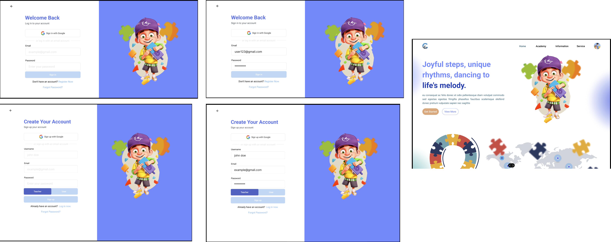

  

# Capable

Capable adalah media pembelajaran interaktif bagi anak berkebutuhan khusus yang terintegrasi dengan machine learning untuk mengukur fokus belajar anak, dengan fitur yang interaktif serta mampu di kontrol oleh orang tua dan guru.

# How Capable Works

  

# Team Members

|         Name         |  Role   |
| :------------------: | :-----: |
|   Difa Dlyaul Haq    | HUSTLER |
|   Shela Widya Sari   | HIPSTER |
| Yogi Efani Yancandra | HACKER  |
|    Kevin Arnandes    | HACKER  |

# Repositories

| Repository |                          Link                           |
| :--------: | :-----------------------------------------------------: |
|  Live Web  |                      [Live Web](#)                      |
|  Frontend  | [FrontEnd](https://github.com/shelawd/Capable--FE.git)  |
|  Backend   | [BackEnd](https://github.com/Vinzzztty/backend-capable) |
